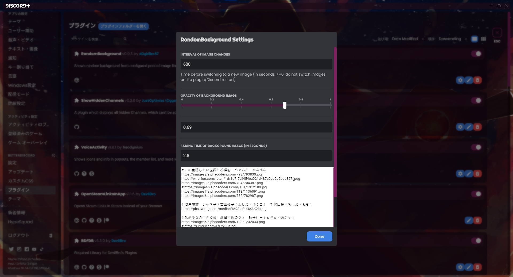

## Installation
- Download [RandomBackground.plugin.js](https://raw.githubusercontent.com/d0gkiller87/discord-plus-random-background/master/RandomBackground.plugin.js) and put it to BetterDiscord's plugin directory (%appdata%\BetterDiscord\plugins)
- Put links of your favorite images in RandomBackground's settings

## Description
Shows random background from configured pool of image links.

## Todo
- Make sure images are fully stretched before fading in instead of doing both at the same time
- Mitigate CPU usage issue (see below)

## Warning
There are noticable CPU usages when switching images.
It's recommanded to set image switching interval to higher value while we are working on it.
Possible solutions are:
1. Pause the plugin while games are detected
2. Preloads every images at once
Please feel free to contribute your thoughts or code on how to fix this headache.
