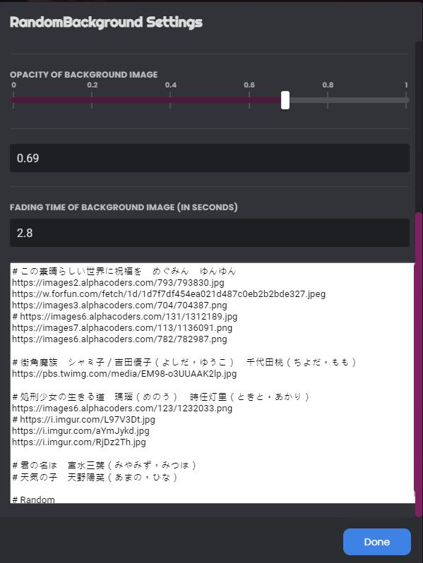

## Installation
- Download [RandomBackground.plugin.js](https://raw.githubusercontent.com/d0gkiller87/discord-plus-random-background/master/RandomBackground.plugin.js) and put it to BetterDiscord's plugin directory (`%appdata%\BetterDiscord\plugins`)
- Put links of your favorite images in RandomBackground's settings

## Building
```bash
npm i
npm run build
```

## Description
Random background feature for the BetterDiscord theme [Discord+](https://github.com/PlusInsta/discord-plus) developed by Insta
### Main


https://github.com/d0gkiller87/discord-plus-random-background/assets/32069685/f614a759-8e87-49e1-afd2-4835de7ef3fe.mp4

### Settings



## Warning
When image transition type is set to anything other than `instant`, expect CPU drains when switching images.
If it affects your gameplay, try setting it back to `instant` or prolong the image switching interval.
